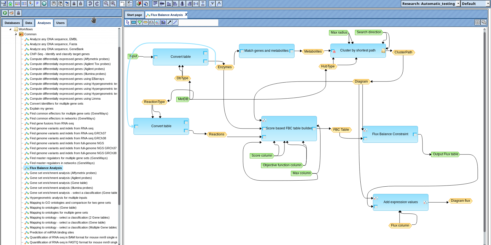

## Summary

The geneXplain platform [@genexplain] is an online toolbox and workflow management
system for a broad range of bioinformatic and systems biology applications. The 
platform is well-known for its upstream analysis [@upstreamAnalysis], that has 
been developed to identify causal signalling molecules on the basis of experimental
data like expression measurements. Methods integrated into the system include

- molecular network analysis such as pathway enrichment, identification of network 
clusters, common signaling regulators or effectors, 
- analysis of transcription factor binding sites like prediction of binding sites using
positional weight matrices, testing for enrichment of binding sites in regulatory sequences,
or identification of composite modules (combinations of binding sites), as well as
motif finding
- methods to test for enrichment of functional groups or categories, e.g. from the Gene Ontology [@GO],
using the Fisher test or Gene Set Enrichment Analysis (GSEA) [@GSEA]
- Flux Balance Analysis [@FBA] to analyze metabolic networks
- methods for processing and statistical analysis of high-throughput data, e.g. Limma [@limma] or DESeq2 [@deseq]
- as well as simulation of computational models, e.g. as collected in the BioModels database [@biomodels].

An important feature of the platform is the possibility to define and execute workflows 
that can implement sequential and parallel multi-step analysis processes. Workflows 
can be created and edited using a graphical editor. They are an effective tool to 
define complex analysis pipelines and to document, reuse and to reproduce analysis
procedures. Figure 1 shows the graphical user interface of the platform with an example
workflow for Flux Balance Analysis.

*Figure 1. Graphical user interface of the geneXplain platform showing the Flux Balance Analysis workflow.*

We have developed geneXplainR, an R [@R] interface for the geneXplain platform, that
makes it possible to define analysis pipelines in the R language using
tools, workflows and other resources integrated in the platform. The package
is based on and extends the rbiouml package [@rbiouml]. The geneXplainR adds basic 
functionality not covered by rbiouml such as creation of projects, folders 
or deletion of items from the workspace as well as functions that provide 
direct access to certain tools or workflows. Another purpose of geneXplainR is
to offer a suite of examples scripts in the *example* branch that help users
to get started with the software. We have also developed a similar project denoted as
the *genexplain-api* [@genexJava] that addresses Java developers and
shall be described elsewhere. With geneXplainR, developers can easily take advantage
of other bioinformatics software and resources available in R, e.g. through
the popular Bioconductor project [@bioconductor].

## Acknowledgements

The development of geneXplainR has been supported by the MyPathSem,
a collaborative project funded by the German Federal Ministry of Education 
and Research (BMBF) in the funding program “i:DSem – Integrative Datensemantik
in der Systemmedizin”, as well as by MIMOmics, a collaborative project funded 
by the European Union Seventh Framework Programme (FP7/2007-2013) under grant
agreement no. 305280, research area FP7-HEALTH-2012-INNOVATION-1, topic 
HEALTH.2012.2.1.1-3: Statistical methods for collection and analysis of –omics data.

## Support

Issue reports and support requests are welcome either by writing an e-mail
to <info@genexplain.com> or through the GitHub issue system (<https://github.com/genexplain/geneXplainR/issues>).

# References
